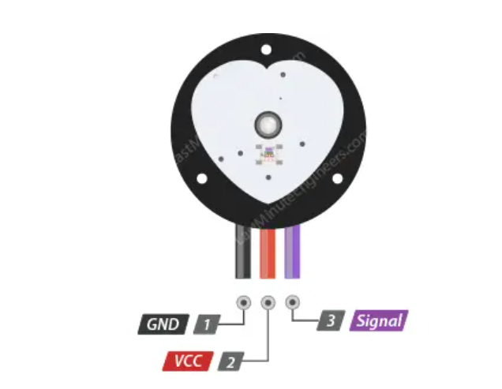
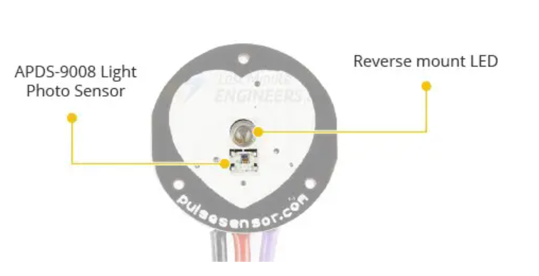
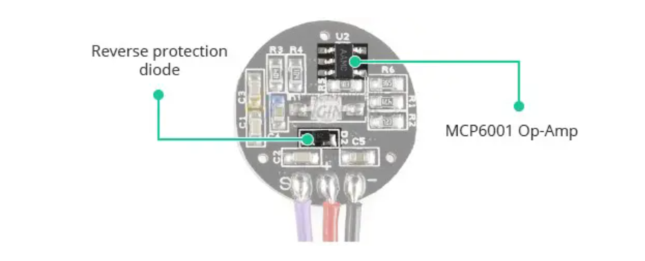
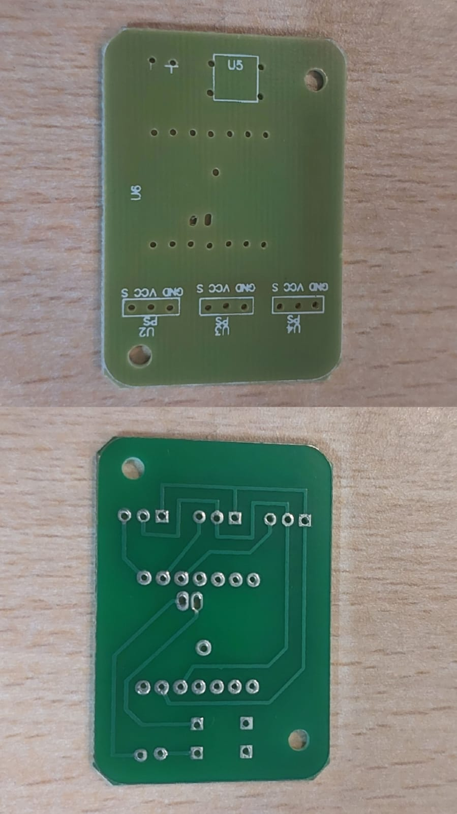
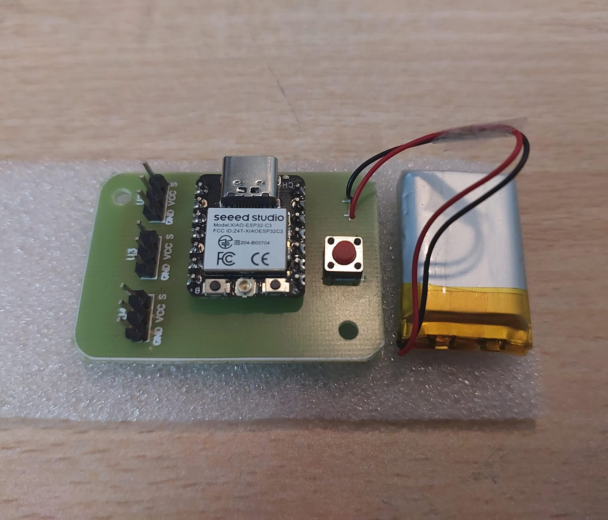
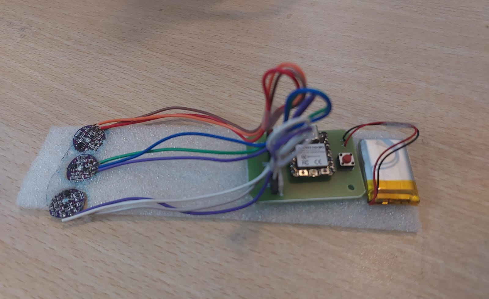
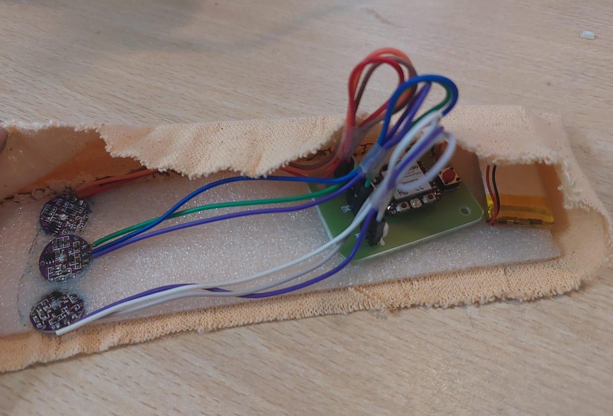

# Pulse-sensor
## AIM
-To demonstrate a PCB level prototype of a wireless wrist pulse recording waveform.

## APPARATUS REQUIRED
-HW-827, ESP32-C3, Jumper Wires, PCB Board

## Theory
1. Pulse Sensor
   -A pulse sensor, works by shining a green light (~ 550nm) on the finger and measuring the amount of reflected light with a photosensor.
   -This optical pulse detection technique is known as a Photoplethysmogram.
   - The sensor comes with a 24″ flat ribbon cable with three male header connectors.
       - S (Signal) is the signal output. Connects to analog input of an Arduino.
       - (VCC +) is the VCC pin. Connects to 3.3 or 5V.
       - (GND -) is the Ground pin.
   
   
   

2. ESP32-C3
   -The ESP32-C3 is a microcontroller SoC (System on a Chip) that has Wi-Fi and Bluetooth 5 (LE) capabilities.
   -It is of 32 bits.

3. PCB and Hardware
   
   
   
   

## Results

   
